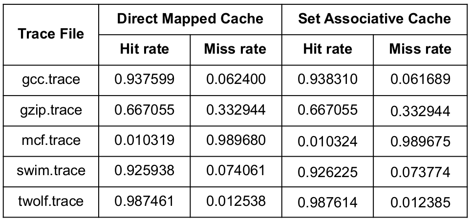

## Cache-python

Implementation of a [Direct Mapped Cache](https://en.wikipedia.org/wiki/Cache_placement_policies#Direct-mapped_cache) and a 4-way [Set Associative Cache](https://en.wikipedia.org/wiki/Cache_placement_policies#Set-associative_cache) in python.

#### To run the python scripts:

- Ensure first that [Python 3.6+](https://www.python.org/downloads/release/python-387/) has been installed.
- For the Direct Mapped Cache, run in the terminal: `python3 DMCache.py`
- For the Set Associative Cache, run in the terminal: `python SACache.py`

#### Hit rates and miss rates of the two caches for five input memory trace files:

**Note**: The LRU (Least Recently Used) policy has been used, for replacement in the 4-way Set Associative Cache.

### Observations:

- Hit rates for the Set Associative Cache are slightly greater than the those for the Direct Mapped Cache.

- Consequently, miss rates for the Set Associative Cache are slightly less than those for the Direct Mapped Cache, for all of the five memory trace files

- These observations confirm to our prediction that the Set Associative Cache is a better cache, considering the "spatial locality" of memory.

